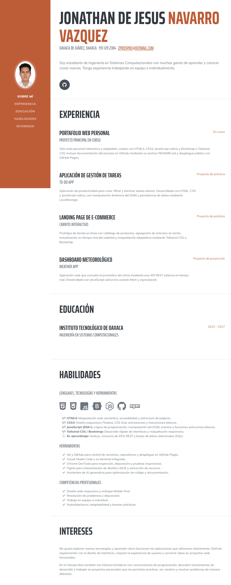

# Portafolio web - Jonathan de Jesus Navarro Vazquez

Portafolio personal y currículum web de **Jonathan de Jesus Navarro Vazquez**, estudiante de Ingeniería en Sistemas Computacionales. El sitio presenta información académica, experiencia, habilidades e intereses mediante una interfaz responsiva que puede consultarse desde computadora, tableta o teléfono.

## Demo y repositorio

- **Portafolio publicado:** [Abrir en GitHub Pages](https://kaiserwastaken.github.io/actividad4/)
- **Repositorio:** [KaiserWasTaken/actividad4](https://github.com/KaiserWasTaken/actividad4)


## Tecnologías y plantilla utilizada

Este proyecto fue construido con:

- **HTML5** para la estructura semántica del portafolio.
- **CSS3** para los estilos y el diseño responsivo.
- **JavaScript nativo** para el desplazamiento suave, el `ScrollSpy` y el comportamiento del menú móvil.
- **Bootstrap 5.2.3** como framework CSS y sistema de componentes.
- **Font Awesome** para los iconos de tecnologías y redes sociales.

Se utilizó la plantilla **Resume - Free Resume/CV Bootstrap Template** de Start Bootstrap como base visual y estructural:

[Resume - Free Resume/CV Bootstrap Template - Start Bootstrap](https://startbootstrap.com/theme/resume)

La plantilla se adaptó al contenido, idioma, identidad y objetivos de este portafolio. No se utilizaron frameworks de JavaScript como React o Vue.

## Secciones del portafolio

La navegación lateral permite desplazarse a las siguientes secciones:

1. **Sobre mí (`about`)**: muestra el nombre, ubicación, datos de contacto, una breve presentación profesional, la fotografía de perfil y el enlace al perfil de GitHub.
2. **Experiencia (`experience`)**: presenta el portafolio como proyecto principal y reúne proyectos de práctica o proyección, como una aplicación de tareas, una landing page de comercio electrónico y un dashboard meteorológico.
3. **Educación (`education`)**: contiene la carrera de Ingeniería en Sistemas Computacionales y el periodo académico en el Instituto Tecnológico de Oaxaca.
4. **Habilidades (`skills`)**: resume conocimientos en HTML5, CSS3, JavaScript, Bootstrap, Git/GitHub y herramientas de desarrollo. También distingue las tecnologías que se encuentran en aprendizaje y las competencias profesionales.
5. **Intereses (`interests`)**: describe el interés por aprender nuevas tecnologías, crear interfaces, mejorar la experiencia de usuario y desarrollar proyectos personales.

La imagen ubicada en `assets/img/profile.jpg` corresponde a una fotografía real, formal y profesional del estudiante, de acuerdo con los requisitos de la actividad.

## Estructura del repositorio

```text
actividad4/
├── index.html              # Página principal del portafolio
├── css/
│   └── styles.css          # Bootstrap y estilos de la plantilla
├── js/
│   └── scripts.js          # ScrollSpy, navegación y menú responsivo
└── assets/
    └── img/
        ├── profile.jpg     # Fotografía de perfil
        ├── favicon.ico     # Icono de la página
        ├── portafolio-escritorio.png
        └── portafolio-movil.png
```

## Proceso de creación

1. **Selección de la plantilla:** se eligió la plantilla Resume de Start Bootstrap porque su formato de currículum con navegación lateral se adapta a la presentación de información personal y académica.
2. **Descarga y revisión:** se descargaron los archivos base de la plantilla y se revisaron su estructura HTML, clases de Bootstrap, estilos y scripts.
3. **Configuración del proyecto:** se organizó el proyecto en una página `index.html`, una carpeta `css`, una carpeta `js` y una carpeta `assets/img`, manteniendo separados el contenido, los estilos, la lógica y los recursos gráficos.
4. **Personalización del contenido:** se reemplazaron los datos de ejemplo por el nombre, ubicación, contacto, formación académica, habilidades e intereses del estudiante.
5. **Adaptación de las secciones:** se conservaron las secciones principales de la plantilla y se ajustaron sus títulos y textos al español. La sección de experiencia se completó con proyectos realizados, de práctica y de proyección para mantener un portafolio informativo.
6. **Fotografía e identidad:** se incorporó una fotografía real y profesional en el menú lateral, junto con el favicon y el enlace al perfil de GitHub.
7. **Comportamiento interactivo:** se mantuvieron los componentes de Bootstrap y se configuró JavaScript para el desplazamiento suave entre secciones, la actualización de la sección activa y el cierre del menú en dispositivos móviles.
8. **Pruebas responsivas:** se revisó la página en diferentes tamaños de pantalla usando las herramientas de desarrollador del navegador para comprobar la navegación y la legibilidad.
9. **Publicación:** se subieron los archivos a un repositorio público de GitHub y se configuró GitHub Pages para publicar el sitio desde la rama principal.

## Capturas de pantalla

Las siguientes capturas muestran el portafolio funcionando en el navegador:

### Vista de escritorio



## Requisitos de la actividad cubiertos

| Criterio | Implementación |
| --- | --- |
| Portafolio funcional basado en una plantilla | Plantilla Resume de Start Bootstrap, personalizada con datos y fotografía profesional |
| HTML, CSS y JavaScript | `index.html`, `css/styles.css` y `js/scripts.js` |
| Uso de Bootstrap o Tailwind | Bootstrap 5.2.3, sin mezclarlo con Tailwind |
| Estructura del repositorio | Código, scripts, estilos e imágenes organizados en sus carpetas |
| Documentación | Este README explica la plantilla, las secciones y el proceso de creación |
| Publicación | Despliegue previsto mediante GitHub Pages |

